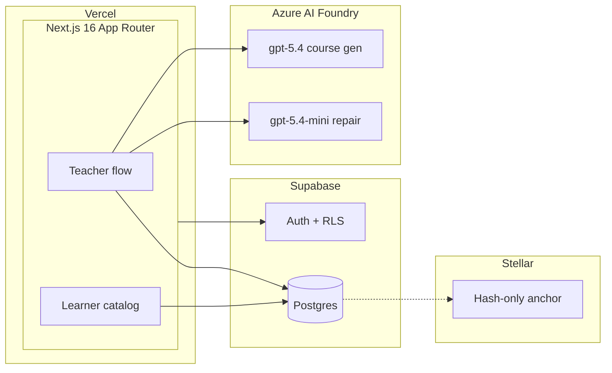

# Aniskwela

[](https://nextjs.org/)
[](https://react.dev/)
[](https://www.typescriptlang.org/)
[](https://tailwindcss.com/)
[](https://supabase.com/)
[](https://learn.microsoft.com/azure/ai-foundry)
[](https://stellar.org/)
[](https://zod.dev/)
[](#license)

**Aniskwela** (*ani* harvest + *eskwela* school) is an AI educational tool built for Filipino farmers. Teachers turn raw documents into structured courses in minutes. Learners study on low-end phones over prepaid 3G. Every completed course can issue a portable, standards-based credential whose tamper-evidence hash is anchored on Stellar.

> *Your learning grows like a field. Slowly, visibly, and it stays yours.*

---

## Why Aniskwela

Global EdTech platforms are built for fast connections, English-first content, and urban learners. Rural Filipino farmers need something different: courses that load on 3G, copy in Filipino, progress they can see, and credentials funders and employers can actually verify.

Aniskwela is **learning-first**, not learn-to-earn. XP and badges are cumulative merit signals. Aniskwela decides grant eligibility; a licensed VASP moves money.

---

## Feature status

Reconciled 2026-06-26. Full specs live in [`docs/`](docs/). This table reflects what is in [`client/`](client/) today.

| Feature | PRD | Status |
|---------|-----|--------|
| AI course generation (teacher upload → draft) | F1 | Built |
| Course catalog & lesson reader | F2 | Partial (quiz display only) |
| Gamification & merit ledger | F3 | Schema only |
| Verifiable credential issuance | F4 | Schema only |
| Public credential verifier | F5 | Not started |
| Teacher dashboard (upload, publish) | F6 | Partial |
| Learner dashboard & credential wallet | F7 | Not started |
| Landing page | F8 | Partial (no waitlist yet) |
| EN / Filipino localization | F9 | Built |
| Funder grant program (simulated) | F10 | Schema only |

See [`docs/index.md`](docs/index.md) §6 for the full PRD-F1..F15 matrix.

---

## Architecture



- **Learner read path:** cached, cookieless Supabase reads. No AI on navigation or lesson views.
- **Teacher write path:** Azure AI Foundry generates a draft once per course; teacher must review before publish.
- **Credentials (roadmap):** W3C VC + Open Badges 3.0; only the credential hash goes on-chain. No PII on Stellar.

---

## Repository layout

```
aniskwela/
├── client/                 # Next.js 16 application
│   ├── src/app/            # App Router pages & API routes
│   ├── src/lib/            # ai/, auth, courses/, supabase/
│   ├── db/migrations/      # Postgres schema + RLS
│   └── messages/           # en.json, fil.json
├── docs/                   # FMD document suite (source of truth)
├── scripts/                # build_pitch_deck.py, etc.
├── AGENTS.md               # Materialized build guide (edit docs/build-aniskwela.md)
└── Aniskwela-Grant-Pitch.pptx
```

---

## Getting started

### Prerequisites

- Node.js 20+
- A Supabase project (URL, anon key, service role key)
- Azure AI Foundry endpoint (optional until you enable AI generation)

### Setup

```bash
cd client
npm install
cp .env.example .env.local
# Edit .env.local with your Supabase and Azure values
npm run dev
```

Open [http://localhost:3000](http://localhost:3000).

### Scripts

| Command | Description |
|---------|-------------|
| `npm run dev` | Start development server (Turbopack default) |
| `npm run build` | Production build |
| `npm run start` | Start production server |
| `npm run typecheck` | TypeScript check |

Apply the database migration in `client/db/migrations/0001_init.sql` to your Supabase project before testing auth or course flows.

---

## Environment variables

| Variable | Required | Description |
|----------|----------|-------------|
| `NEXT_PUBLIC_SUPABASE_URL` | Yes | Supabase project URL |
| `NEXT_PUBLIC_SUPABASE_ANON_KEY` | Yes | Supabase anon key |
| `SUPABASE_SERVICE_ROLE_KEY` | Server | Service role key (server only) |
| `AZURE_OPENAI_ENDPOINT` | For AI | Azure AI Foundry endpoint |
| `AZURE_OPENAI_API_KEY` | Optional | Local dev fallback; prefer Managed Identity in prod |
| `ENABLE_AI_GENERATION` | Flag | Set `true` to enable `POST /api/courses/generate` |
| `ENABLE_ONCHAIN_ANCHOR` | Flag | Reserved for Stellar anchoring (not wired yet) |

Full contract: [`client/.env.example`](client/.env.example) and [`client/src/lib/env.ts`](client/src/lib/env.ts).

---

## Documentation

Start at [`docs/index.md`](docs/index.md), then read in order:

| Doc | Purpose |
|-----|---------|
| [PRD](docs/prd-aniskwela.md) | Features, user stories, flows |
| [SDD](docs/sdd-aniskwela.md) | Architecture, schema, APIs |
| [DSD](docs/dsd-aniskwela.md) | Design tokens, low-resource rules |
| [BUILD](docs/build-aniskwela.md) | Stack, patterns, guardrails |

RFCs: [credential issuance](docs/rfc-aniskwela-credential-issuance.md), [AI course generation](docs/rfc-aniskwela-ai-course-generation.md).

**Pitch materials:** [`Aniskwela-Grant-Pitch.pptx`](Aniskwela-Grant-Pitch.pptx) and [`docs/pitch-script-aniskwela.md`](docs/pitch-script-aniskwela.md).

---

## Design & performance

Aniskwela follows an earthen, legible design language (warm paper backgrounds, growth green, indigo for trust CTAs). System fonts only. No web-font downloads on first paint.

**Hard budgets:** initial JS ≤ 220 KB gzipped, images ≤ 80 KB WebP, core content < 5 s on 3G.

> **Note:** DSD tokens are documented in [`docs/dsd-aniskwela.md`](docs/dsd-aniskwela.md) but not yet applied in `client/src/app/globals.css` (open M2 task).

---

## Team

**Axon Enjin**

- Carlos Jerico Dela Torre
- Rhandie Sales Jr.
- Aidan Tiu
- Gerald Berongoy

Implementation task board: [`rhandie-tasks.md`](rhandie-tasks.md).

---

## License

Private. All rights reserved.
