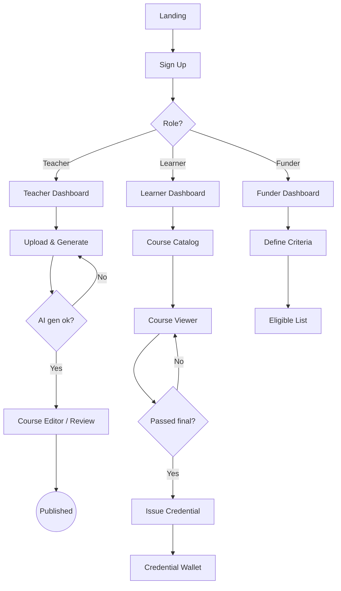

# Product Requirements Document (PRD)

**Project:** Aniskwela
**Date:** 2026-06-23
**Version:** 1.2
**Owner:** Carlos Jerico Dela Torre
**Status:** Locked
**Last reconciled:** 2026-06-23
**BRD:** [brd-aniskwela.md](brd-aniskwela.md)

> **History:** Supersedes the standalone `LearnChain_PRD_v2.md` (which itself superseded v1). v2 applied partner-review fixes — honest "near-zero" cost language; W3C VC + Open Badges 3.0 in place of a custom Stellar memo; evidence-based learning science in place of VARK learning-styles; learning-first (not learn-to-earn) reframe; eligibility-layer-only grant posture; offline caching pulled to Phase 1; competitive landscape and data-privacy sections added; DAU/MAU reset to 15–18%. The framework is pinned to Next.js 16.2.x and the AI provider is OpenAI GPT-5.4/GPT-5.4-mini via Azure AI Foundry. The product name was locked to **Aniskwela** (*ani* harvest + *eskwela* school) on 2026-06-23 (see [cr-aniskwela-001.md](cr-aniskwela-001.md)), which also sharpened the positioning to **farmer-first**; the earlier placeholders "LearnChain" and "Gaia" are retired.

---

## 1. Product Purpose & Value Proposition

Aniskwela is an AI educational tool built for Filipino farmers: it delivers gamified, blockchain-verified agricultural and livelihood education to anyone with a low-end smartphone and a low-bandwidth connection. The learning engine is content-agnostic — the same pipeline serves any subject — but the product is designed for, and goes to market with, farmers and rural learners first. Teachers turn raw materials into structured courses in minutes; learners follow evidence-based, reinforcement-scheduled lessons and build a persistent, tamper-evident merit record; and every completed course issues a portable, standards-based credential whose tamper-evidence hash is anchored on Stellar. Aniskwela is **learning-first**: gamification is optional and rewards are an outcome of sustained learning, never the hook. Its differentiators — AI course creation, a merit ledger tied to verifiable grant eligibility, and open-standard credentials — are wrapped in Filipino-first localization and sub-3G performance that global incumbents do not build for.

---

## 2. Target Personas

**Primary Persona — Maricel, the rural learner**
- *Who they are:* 22, in Region IV (rural Philippines), shares a 1GB-RAM Android phone, on prepaid 3G data. Wants to upskill in agriculture and financial literacy. Comfortable in Filipino, learning English.
- *Their core frustration:* Existing courses don't load on her connection, cost data she can't spare, are English-only, and give her nothing verifiable to show for the effort.
- *What success looks like for them:* Completes lessons offline-capably, sees visible progress (XP/streak), earns a credential an employer or NGO will actually trust, and may qualify for a grant.

**Primary Persona — Ramon, the teacher/coach**
- *Who they are:* 38, agricultural extension worker and subject-matter expert, no coding or video-production skills.
- *Their core frustration:* Building a structured online course is too time-consuming and technical; centralized platforms take 30–50% of revenue.
- *What success looks like for them:* Uploads a PDF, reviews an AI-generated course, publishes in an afternoon, keeps the large majority of any revenue, and sees learner analytics.

**Secondary Persona — Divina, the funder/NGO program officer**
- *Who they are:* Program officer at a foundation / TESDA / a CSR team, accountable for donor outcomes.
- *Their core frustration:* No verifiable, transparent way to target merit-based grants to individual learners, and no auditable disbursement trail.

---

## 3. Core Features & Priorities

MoSCoW. Each feature has a stable `PRD-F#` ID — permanent, never renumbered. Downstream docs (SDD, RFCs, QAD, CLR, SAD, BUILD) trace back to these IDs.

| ID | Feature | Description | Priority |
|----|---------|-------------|----------|
| PRD-F1 | AI Course Generation | Teacher uploads PDF/doc; Claude generates module outline, sub-lessons, quizzes, summary cards, difficulty tags. Never auto-published. | Must-Have |
| PRD-F2 | Course Viewer & Quiz | Learner-facing lesson reader (text + image) and quiz component; records completion/score. | Must-Have |
| PRD-F3 | Gamification & Merit Ledger | XP, streaks, badges, levels (Seed→Sprout→Scholar→Expert→Mentor); cumulative, never spent; the substrate funders evaluate. | Must-Have |
| PRD-F4 | Verifiable Credential Issuance | On passing the final assessment, issue a W3C VC (Open Badges 3.0 profile); anchor only the credential hash on Stellar Testnet. → [rfc-aniskwela-credential-issuance.md](rfc-aniskwela-credential-issuance.md) | Must-Have |
| PRD-F5 | Public Credential Verifier | No-login URL + QR; verifies signature and confirms the on-chain hash matches; interoperable with any OB 3.0 / VC verifier. | Must-Have |
| PRD-F6 | Teacher Dashboard | Upload, review/edit AI structure, set price/mode/passing score, view learner analytics. | Must-Have |
| PRD-F7 | Learner Dashboard & Credential Wallet | XP bar, level, streak, my courses, credential wallet with share links/QR, grant status. | Must-Have |
| PRD-F8 | Landing Page + Waitlist | EN + Filipino marketing surface; the pitch artifact and conversion tool. | Must-Have |
| PRD-F9 | Localization (EN/Filipino) | Instant in-place language toggle across the whole platform (no reload). | Must-Have |
| PRD-F10 | Funder Grant Program (mock) | Funder UI: define eligibility criteria against the merit ledger; simulated disbursement; audit report; optional demo-only Stellar Testnet payout drill from the latest simulation snapshot. | Should-Have |
| PRD-F11 | Wallet Connect (Freighter) | Basic Stellar wallet connection for the demo, including optional payout-address save for learners and funder-side Testnet signing. | Should-Have |
| PRD-F12 | AI Assist Adaptive Engine | Spaced repetition, retrieval practice, mastery progression, difficulty calibration (IRT/Elo), ADHD chunking. **Evidence-based, not VARK.** | Could-Have (Phase 1) |
| PRD-F13 | Offline Lesson Caching (PWA) | Service-worker caching of current + next two lessons; sync on reconnect. | Could-Have (Phase 1) |
| PRD-F14 | Real Stablecoin Disbursement | Live grant payout via licensed VASP / e-money rail; teacher earnings/withdrawals. | Won't-Have (v1 / MVP) |
| PRD-F15 | Org Multi-Seat Workspaces | Shared NGO/school workspace with multiple teacher seats. | Won't-Have (v1 / MVP) |

---

## 4. User Stories & Acceptance Criteria

**US-01 — Teacher generates a course from a document** *(PRD-F1, PRD-F6)*
> As a teacher, I want to upload a PDF and get a structured course draft so that I can publish without building it from scratch.

Acceptance Criteria:
- Given a logged-in teacher with a valid PDF (≤ size limit), when they upload it and start generation, then within the latency budget they receive an editable module outline + sub-lessons + at least 3 quiz questions + difficulty tags.
- Given a generated draft, when the teacher has not reviewed it, then it cannot be published (no auto-publish path exists).
- Given AI generation fails or times out, when the teacher is waiting, then a clear error and a retry option are shown, and no partial course is published.

**US-02 — Learner completes a lesson and earns XP** *(PRD-F2, PRD-F3)*
> As a learner, I want to complete a lesson and see my XP and streak increase so that I feel progress.

Acceptance Criteria:
- Given a learner on a lesson, when they complete it and pass the quiz, then XP is awarded, the streak updates, and the new totals are visible on the dashboard.
- Given XP is awarded, when later viewed, then it is never decremented or "spent" (cumulative merit signal).

**US-03 — Learner earns a verifiable credential** *(PRD-F4, PRD-F7)*
> As a learner, I want a verifiable credential when I complete a course so that I can prove it to employers and funders.

Acceptance Criteria:
- Given a learner passes the final assessment at/above the teacher's passing score, when issuance runs, then a W3C VC (OB 3.0 profile) is generated, its hash is anchored in a Stellar Testnet transaction, and the learner gets a shareable URL + QR.
- Given the on-chain anchor fails during a live demo, when issuance is attempted, then the system degrades to a clearly-labelled mock anchor (demo fallback) rather than blocking.

**US-04 — Anyone verifies a credential without an account** *(PRD-F5)*
> As a third party (employer/funder), I want to verify a credential without logging in so that I can trust it.

Acceptance Criteria:
- Given a credential URL or QR, when opened, then the verifier checks the signature and confirms the on-chain hash matches, and shows a clear valid/invalid result with course, learner identifier, date, and score.
- Given a tampered credential, when verified, then the result is clearly "invalid".

**US-05 — Funder defines grant eligibility** *(PRD-F10)*
> As a funder, I want to set criteria against the merit ledger so that I can target grants transparently.

Acceptance Criteria:
- Given a funder on the program builder, when they set criteria (e.g. "Agriculture learners with ≥ 30,000 XP and the Consistent Learner badge"), then the system returns the matching eligible-learner list.
- Given a program is "funded" in the MVP, when disbursement is triggered, then it runs a clearly-labelled **simulation** (no real funds move) and produces an exportable audit report.
- Given a funder has already recorded a simulated disbursement and uses Freighter on Stellar Testnet, when they start the demo-only payout drill, then the system prepares a Testnet XLM transaction from the latest simulation snapshot and records the submitted tx hash separately from the simulation audit.

**US-06 — Learner switches language** *(PRD-F9)*
> As a Filipino learner, I want to switch between Filipino and English instantly so that I can learn in my language.

Acceptance Criteria:
- Given any page, when the learner toggles language, then all UI text switches in place with no page reload and the preference persists.

---

## 5. App Flow & UX Intent

**Design reference:** [dsd-aniskwela.md](dsd-aniskwela.md)

### 5.1 Screen Inventory

| Screen | Purpose | Entry points | States to design |
|--------|---------|--------------|------------------|
| Landing (EN/Filipino) | Pitch + waitlist conversion | cold URL, shared link | static / form-submitting / success / error |
| Sign Up / Login | Auth (email/password) | landing CTA, deep link | empty / loading / error / success |
| Teacher Dashboard | Manage courses & analytics | post-login (teacher) | empty (no courses) / loading / error / populated |
| Upload & Generate | Upload doc → AI course draft | teacher dashboard | idle / uploading / generating / review / error |
| Course Editor | Review/edit AI draft, set mode/price/passing | after generation | draft / saving / published / error |
| Course Catalog | Browse/search by industry | learner dashboard, landing | loading / results / empty / error |
| Course Viewer | Read lesson, take quiz | catalog, my courses | loading / lesson / quiz / completed / error |
| Learner Dashboard | XP/level/streak, my courses, wallet | post-login (learner) | empty / loading / populated |
| Credential Wallet | Earned credentials + share/QR | learner dashboard | empty / list / detail |
| Public Verifier | Verify a credential, no login | credential URL/QR | loading / valid / invalid / not-found |
| Funder Dashboard | Define program, see eligible list, audit | post-login (funder) | empty / building / results / error |
| Wallet Connect | Freighter connection | learner/funder flows | disconnected / connecting / connected / error |

*Every interactive screen defines empty / loading / error / success states.*

### 5.2 App Flow

**Legend:** `[Screen]` = screen · `{Decision}` = branch · `((Exit))` = terminal · `-->|condition|` = conditional.

**Linear (primary learner path):**

`Landing → Sign Up → Learner Dashboard → Course Catalog → Course Viewer → (pass final) → Credential Issued → Credential Wallet`

**Linear (primary teacher path):**

`Landing → Sign Up → Teacher Dashboard → Upload & Generate → Course Editor (review) → Publish`

**Branching (Mermaid):**

**Flow annotations:**

| Flow concern | Detail |
|--------------|--------|
| Entry points | Cold landing URL, shared course/credential deep link, QR scan to verifier, waitlist email link |
| Decision branches | Role (teacher/learner/funder); AI generation success; final-assessment pass; on-chain anchor success vs demo fallback |
| Dead ends | None — verifier and catalog are reachable without auth; every authed screen has a back path to its dashboard |
| Abandonment / exit | Upload abandoned mid-generation → draft saved, resumes; lesson exit → progress saved per lesson |
| Edge cases | Offline / slow 3G, AI timeout, Stellar Testnet downtime (demo fallback), duplicate submit, session expiry, wallet not installed |

### 5.3 Onboarding Flow

- **Aha / first-value moment:** Teacher — sees a usable course draft seconds after upload. Learner — completes first lesson and watches XP/streak tick up.
- **Time-to-first-value target:** < 5 minutes (teacher upload→draft; learner signup→first lesson complete).
- **Skippable / resumable:** Yes — onboarding is minimal; teacher upload resumes at last step.
- **Friction budget:** Email + password only at signup; role chosen once; everything else deferred. No wallet required to learn.

### 5.4 UX Constraints

- Mobile-first; primary breakpoint 375px; must work from 320px up.
- Core content must load < 5s on 3G; light theme only (Phase 1); system fonts only; no image > 80KB on first load.
- Language toggle (EN/Filipino) available in the navbar on every screen, switching in place.
- ADHD-friendly: clear progress indicators, lesson chunks ≤ 7 minutes, frequent micro-rewards.

### 5.5 Instrumentation & Event Taxonomy

| Event name | Fires when | Key properties | Feeds metric |
|------------|-----------|----------------|--------------|
| `waitlist_submitted` | Email captured on landing | source, locale, ts | BRD-M2 waitlist |
| `signup_completed` | User verifies/creates account | user_id (hashed), role, locale, ts | BRD-M3 learners |
| `course_published` | Teacher publishes a reviewed course | course_id, teacher_id, industry, ts | BRD-M4 courses |
| `lesson_completed` | Learner completes a lesson | user_id, course_id, lesson_id, ts | BRD-M5 DAU/MAU |
| `quiz_passed` | Learner passes a quiz | user_id, course_id, score, ts | engagement |
| `credential_issued` | VC issued + hash anchored | credential_id, course_id, network, anchored:bool, ts | BRD-M6 credentials |
| `grant_program_funded` | Funder funds a program (sim in MVP) | program_id, criteria_hash, simulated:bool, ts | BRD-M7 grants |

**Naming convention:** snake_case `object_action`, past tense; no PII in property values (hash user IDs).
**Analytics tool:** PostHog (free tier) + Vercel Analytics for page performance.

---

## 6. Out of Scope for This Release

- Video upload/processing — deferred to Phase 1 (Cloudflare Stream has no free tier; MVP demo uses text/PDF only).
- Full AI Assist adaptive engine (PRD-F12) — Standard Mode only in MVP; Phase 1.
- Real stablecoin/fiat disbursement and teacher withdrawals (PRD-F14) — mock UI only in MVP; Phase 1 via licensed VASP. Demo-only Stellar Testnet payout drills do not change this boundary.
- Offline lesson caching (PRD-F13) — Phase 1.
- Org/multi-seat workspaces (PRD-F15) — Phase 2.
- Native Android/iOS apps — Phase 2 (PWA first).

---

## 7. AI / Agent Feature Specifications

**AI Component:** Course generation (PRD-F1) and, in Phase 1, the adaptive engine (PRD-F12). See [rfc-aniskwela-ai-course-generation.md](rfc-aniskwela-ai-course-generation.md).
**Model(s) considered:** GPT-5.4, GPT-5.4 Mini.
**Selected model:** `gpt-5.4` for course generation (mid-tier; balanced structure/reasoning at mid cost); `gpt-5.4-mini` for cheap structural tasks (outline diffs, quiz reshuffles, summary-card generation, schema repair) — *reason: cost discipline; route low-complexity work to the efficiency model.*

**What the AI does:**
Analyzes uploaded source material and produces a structured course: module outline → chapters → sub-lessons, quiz questions/assessments, summary cards, audio-friendly text, and difficulty tags (Beginner/Intermediate/Advanced).

**Input → Output contract:**
- Input: extracted text from the uploaded PDF/doc + a structured generation prompt (system prompt + source cached).
- Output: validated JSON course structure (outline, lessons, quizzes, tags).
- Latency expectation: course generated within a single bounded call (target < ~60s for a typical document; show progress).
- **Prompt caching:** Azure OpenAI automatically caches prompt prefixes ≥ 1024 tokens — place system prompt + source document first in the messages array; variable hints last. No SDK configuration required. Azure optionally supports extended retention up to 24h (configurable per deployment).

**Human-in-the-loop points:**
- Mandatory teacher review-and-edit before any course is published (no auto-publish — R5).
- High-stakes verticals (health/finance/agri) carry an additional Phase 1 review tier.

**Fallback behavior when AI fails or is unavailable:**
Surface a clear error with a retry; never publish a partial/unreviewed course. AI is never on the critical read path for learners (see cost gating below).

**Token / cost budget per operation:**
Course generation is called **once per course** with prompt caching (system prompt + source document cached) to cut repeat-call input cost. AI is deliberately gated — never called on content reads, quiz answers, or navigation. Adaptive-engine calls (Phase 1) occur only at session boundaries / milestone triggers (≈ once per learner per day), with hard per-call token limits.

---

## 8. Dependencies & Assumptions

**Dependencies:**
- Azure AI Foundry access — `AZURE_OPENAI_ENDPOINT` + `DefaultAzureCredential` (Managed Identity) or `AZURE_OPENAI_API_KEY` fallback for local dev. Never client-side. Verify deployment names (`gpt-5-4`, `gpt-5-4-mini`) and region quota at project setup.
- Supabase project (Postgres, Auth, Storage) with Row Level Security.
- Stellar Testnet + Horizon (public node) for MVP; Freighter for demo wallet.
- VC issuer signing key in a secure secrets store (issuer = Aniskwela at the platform level).
- Vercel (Hobby for demo; paid plan required for any commercial launch).

**Assumptions:**
- Demo-scale traffic fits free tiers (~1,000 users); production at ~1,000 users is ~$50–150/month (honest, not zero-cost).
- Learners access primarily from low-end Android on sub-3G; **learners are not required to hold a Stellar account** (wallet/custody only matters at grant-receipt time).
- Real disbursement is always partner-executed; Aniskwela is the eligibility-decision layer and not a money transmitter. The only exception in MVP is a **demo-only Testnet payout drill** signed by the funder’s own Freighter wallet from a previously simulated recipient snapshot.

---

## 9. Implementation Plan

| # | Phase / Milestone | Entry criteria | Exit criteria (DoD) | Deliverable | Depends on | Owner (DRI) | Top risk |
|---|-------------------|----------------|----------------------|-------------|------------|-------------|----------|
| M1 | Planning & specs locked | BRD/PRD drafted | This suite Locked; MVP scope (§3) frozen | Approved doc suite | — | Owner | Scope creep |
| M2 | Design (UX + system) | PRD locked | DSD + SDD approved; tokens in code | Design system + architecture | M1 (Next.js 16.2.x; OpenAI GPT) | Owner | Slop defaults / perf budget |
| M3 | Week 1 build | Design signed off | Landing (EN/Fil), auth, upload, AI generation working | Demo-able teacher flow | M2 | Owner | AI cost / output quality |
| M4 | Week 2 build | Week 1 features stable | Course viewer, XP/badges, VC issuance + verifier | Demo-able learner flow | M3 | Owner | Stellar Testnet downtime |
| M5 | Week 3 build + QA | Core flows pass | Funder mock UI, wallet connect, QAD release criteria met, 0 P0/P1 | Hackathon-ready build | M4 | Owner | Time / polish |
| M6 | Demo + post-launch | QA signed off | Live demo delivered; waitlist live; metrics reviewed at 30d | Production demo + monitoring | M5 | Owner | Demo-day failure |

**Rollout strategy:** feature-flag + phased (demo → public beta → growth) — *reason: de-risk a live hackathon demo and stage regulated features (disbursement) behind flags until partners/compliance are ready.*

**Rollback plan:**
- *Trigger criteria:* any P0 in the first 24h of a public deploy, error rate > 2%, or Stellar anchoring failures affecting issuance.
- *Revert mechanism:* redeploy the previous tagged Vercel release; DB migrations kept backward-compatible for one release; `ENABLE_ONCHAIN_ANCHOR` flag falls back to mock anchoring for the demo.

**RFC cross-reference:** credential issuance → [rfc-aniskwela-credential-issuance.md](rfc-aniskwela-credential-issuance.md) §7; AI course generation → [rfc-aniskwela-ai-course-generation.md](rfc-aniskwela-ai-course-generation.md) §7.

---

## Self-Check

- [x] Every Must-Have feature has at least one user story (US-01..US-06 cover PRD-F1–F10)
- [x] Acceptance criteria are testable (Given/When/Then)
- [x] §5.1 every interactive screen defines empty/loading/error/success
- [x] §5.2 flow has no unintended dead ends; entry/exit/edge cases annotated
- [x] §5.5 every BRD-M# metric has a feeding event
- [x] §6 names discussed-but-cut items
- [x] §7 AI section filled
- [x] §9 covers through post-launch with explicit rollback trigger + mechanism
- [x] Answers *what* to build; *how* lives in the SDD/RFCs
