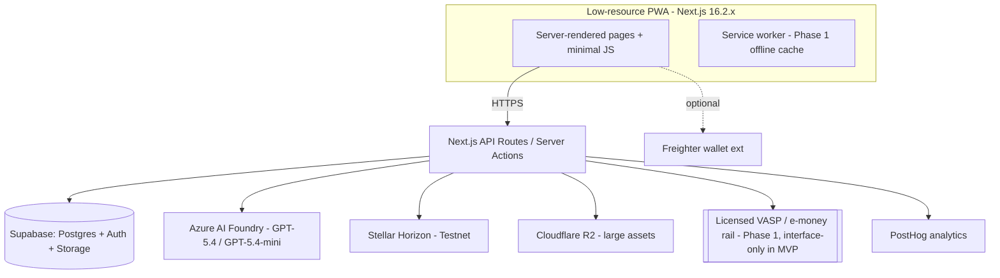

# System Design Document (SDD)

**Project:** Aniskwela
**Date:** 2026-06-23
**Version:** 1.1
**Owner:** Carlos Jerico Dela Torre
**Status:** Locked
**Last reconciled:** 2026-06-23 — `waitlist` table + PRD-F8 landing/waitlist API
**PRD:** [prd-aniskwela.md](prd-aniskwela.md)

---

## 1. Architectural Vision & Principles

**Architecture style:** Serverless monolith on Vercel — Next.js 16.2.x (App Router) front + API routes, Supabase (Postgres/Auth/Storage) as the data plane, Stellar accessed via SDK from server routes. Single deployable; clean module boundaries (`app/`, `lib/`, `db/`, `components/`).

**Guiding principles:**
- **Low-resource first is a constraint, not a goal.** Every architectural choice is checked against sub-3G / 1GB-RAM Android. Server-render by default; ship the minimum JS.
- **AI decides, deterministic code does the work.** Claude is called only at course-creation and (Phase 1) session boundaries — never on the learner read path. All money/identity-critical operations are deterministic and auditable.
- **Open standards over proprietary blobs.** Credentials are W3C VC + Open Badges 3.0; only a hash touches the chain.
- **Eligibility layer, not money transmitter.** Aniskwela evaluates criteria and produces verified recipient lists; a licensed VASP moves funds. No private custody of learner funds in the platform.
- **Fail loudly in dev, gracefully in prod.** Demo-critical paths (on-chain anchoring) have a labelled fallback.

**Key trade-offs made (documented debt):**
- Single Supabase instance for MVP — read replicas/partitioning deferred until well past demo scale.
- No job queue in MVP — AI generation runs in a bounded serverless request; if generation time exceeds limits at scale, move to a background worker (Phase 1 debt).
- Mock disbursement in MVP — the real VASP integration is a Phase 1 boundary, isolated behind an interface so the funder UI doesn't change.
- Open-standard VC adds signing/schema/issuer-key complexity over a custom memo — accepted for interoperability and credibility.

---

## 2. High-Level Architecture

**Layers:**

| Layer | Technology | Responsibility |
|-------|------------|----------------|
| Client | Next.js 16.2.x App Router, Tailwind, next-intl, next-pwa | Server-first rendering; EN/Filipino i18n; offline cache (Phase 1); minimal client JS; `'use cache'` directive for explicit caching; Turbopack default bundler |
| API / Gateway | Next.js API Routes / Server Actions (serverless on Vercel) | Auth-guarded business logic, AI calls, credential issuance, Stellar anchoring, eligibility evaluation |
| Service / Compute | Inline server functions (MVP); background worker (Phase 1 for AI/disbursement) | Course generation orchestration, VC signing, criteria evaluation |
| Data | Supabase Postgres (+ RLS), Supabase Storage, Cloudflare R2 | Users, courses, lessons, quizzes, XP/merit ledger, credentials, grant programs |
| Infrastructure | Vercel, Supabase, Stellar Horizon (public), PostHog, Vercel Analytics | Hosting, DB, chain access, analytics |

---

## 3. Data Architecture

**Primary database:** Supabase PostgreSQL — *reason: free tier covers demo (Auth + Storage + Postgres in one), RLS enforces per-user isolation, SQL fits the relational merit/credential model.*
**Secondary / cache:** Prompt caching at the Anthropic API layer (system prompt + source doc); HTTP/CDN caching for static lesson content. No Redis in MVP — *reason: avoid infra cost; revisit at scale.*
**Vector store (if AI):** N/A for MVP — course generation is single-document, no RAG retrieval needed. (Phase 1 adaptive engine may add pgvector for cross-course reinforcement.)

### Backend Schema

**Table: `profiles`** (extends Supabase `auth.users`)

| Column | Type | Null? | Default | Key / Index | Constraint |
|--------|------|-------|---------|-------------|------------|
| `id` | UUID | No | — | PK, FK → `auth.users.id` | ON DELETE CASCADE |
| `role` | TEXT | No | `'learner'` | — | CHECK in ('learner','teacher','funder') |
| `display_name` | TEXT | Yes | — | — | — |
| `locale` | TEXT | No | `'en'` | — | CHECK in ('en','fil') |
| `created_at` | TIMESTAMPTZ | No | now() | — | — |

**Table: `courses`**

| Column | Type | Null? | Default | Key / Index | Constraint |
|--------|------|-------|---------|-------------|------------|
| `id` | UUID | No | gen_random_uuid() | PK | — |
| `teacher_id` | UUID | No | — | FK → `profiles.id` | ON DELETE CASCADE |
| `title` | TEXT | No | — | — | — |
| `industry` | TEXT | No | — | idx | category tag |
| `mode` | TEXT | No | `'standard'` | — | CHECK in ('standard','ai_assist') |
| `passing_score` | INT | No | 70 | — | 0–100 |
| `status` | TEXT | No | `'draft'` | idx | CHECK in ('draft','published') |
| `source_object_path` | TEXT | Yes | — | — | Supabase Storage path |
| `created_at` | TIMESTAMPTZ | No | now() | — | — |

**Table: `lessons`**

| Column | Type | Null? | Default | Key / Index | Constraint |
|--------|------|-------|---------|-------------|------------|
| `id` | UUID | No | gen_random_uuid() | PK | — |
| `course_id` | UUID | No | — | FK → `courses.id` | ON DELETE CASCADE |
| `order_index` | INT | No | — | idx (course_id, order_index) | — |
| `title` | TEXT | No | — | — | — |
| `body_md` | TEXT | No | — | — | lesson content (markdown) |
| `difficulty` | TEXT | No | `'beginner'` | — | CHECK in ('beginner','intermediate','advanced') |

**Table: `quiz_questions`**

| Column | Type | Null? | Default | Key / Index | Constraint |
|--------|------|-------|---------|-------------|------------|
| `id` | UUID | No | gen_random_uuid() | PK | — |
| `lesson_id` | UUID | No | — | FK → `lessons.id` | ON DELETE CASCADE |
| `prompt` | TEXT | No | — | — | — |
| `choices` | JSONB | No | — | — | array of options |
| `answer_index` | INT | No | — | — | — |

**Table: `enrollments`**

| Column | Type | Null? | Default | Key / Index | Constraint |
|--------|------|-------|---------|-------------|------------|
| `id` | UUID | No | gen_random_uuid() | PK | — |
| `learner_id` | UUID | No | — | FK → `profiles.id` | ON DELETE CASCADE |
| `course_id` | UUID | No | — | FK → `courses.id` | UNIQUE (learner_id, course_id) |
| `progress` | JSONB | No | `'{}'` | — | per-lesson completion |
| `completed_at` | TIMESTAMPTZ | Yes | — | — | — |
| `final_score` | INT | Yes | — | — | 0–100 |

**Table: `merit_ledger`** (XP events — append-only; current XP is a sum)

| Column | Type | Null? | Default | Key / Index | Constraint |
|--------|------|-------|---------|-------------|------------|
| `id` | UUID | No | gen_random_uuid() | PK | — |
| `learner_id` | UUID | No | — | FK → `profiles.id`, idx (learner_id, created_at) | ON DELETE CASCADE |
| `event_type` | TEXT | No | — | — | CHECK in ('lesson','quiz','streak','help') |
| `xp_delta` | INT | No | — | — | **always ≥ 0 — XP is never burned** |
| `ref_id` | UUID | Yes | — | — | lesson/course/quiz reference |
| `created_at` | TIMESTAMPTZ | No | now() | — | — |

**Table: `badges`**

| Column | Type | Null? | Default | Key / Index | Constraint |
|--------|------|-------|---------|-------------|------------|
| `id` | UUID | No | gen_random_uuid() | PK | — |
| `learner_id` | UUID | No | — | FK → `profiles.id` | ON DELETE CASCADE |
| `badge_type` | TEXT | No | — | idx | e.g. consistent_learner, first_course |
| `awarded_at` | TIMESTAMPTZ | No | now() | — | — |

**Table: `credentials`**

| Column | Type | Null? | Default | Key / Index | Constraint |
|--------|------|-------|---------|-------------|------------|
| `id` | UUID | No | gen_random_uuid() | PK | — |
| `learner_id` | UUID | No | — | FK → `profiles.id` | ON DELETE CASCADE |
| `course_id` | UUID | No | — | FK → `courses.id` | — |
| `vc_jsonld` | JSONB | No | — | — | full signed W3C VC (OB 3.0 profile) |
| `credential_hash` | TEXT | No | — | UNIQUE idx | SHA-256 of canonical VC |
| `stellar_tx_hash` | TEXT | Yes | — | — | anchor tx; null if mock/pending |
| `network` | TEXT | No | `'testnet'` | — | CHECK in ('testnet','mainnet','mock') |
| `issued_at` | TIMESTAMPTZ | No | now() | — | — |

**Table: `grant_programs`**

| Column | Type | Null? | Default | Key / Index | Constraint |
|--------|------|-------|---------|-------------|------------|
| `id` | UUID | No | gen_random_uuid() | PK | — |
| `funder_id` | UUID | No | — | FK → `profiles.id` | ON DELETE CASCADE |
| `name` | TEXT | No | — | — | — |
| `criteria` | JSONB | No | — | — | e.g. {industry, min_xp, required_badges, region} |
| `amount_per_learner` | NUMERIC | Yes | — | — | display only in MVP |
| `simulated` | BOOLEAN | No | true | — | **MVP: always true (no real funds)** |
| `created_at` | TIMESTAMPTZ | No | now() | — | — |

**Table: `waitlist`** *(PRD-F8 — landing email capture; inserts via service role only)*

| Column | Type | Null? | Default | Key / Index | Constraint |
|--------|------|-------|---------|-------------|------------|
| `id` | UUID | No | gen_random_uuid() | PK | — |
| `email` | TEXT | No | — | UNIQUE idx on `lower(email)` | — |
| `locale` | TEXT | No | `'en'` | — | CHECK in ('en','fil') |
| `source` | TEXT | Yes | `'landing'` | — | e.g. landing, campaign |
| `created_at` | TIMESTAMPTZ | No | now() | — | — |

RLS enabled; **no** anon/auth policies — public capture only through `POST /api/waitlist` (server service role).

**Key relationships:**
- `profiles` 1:N `courses` (teacher), `enrollments` / `merit_ledger` / `badges` / `credentials` (learner), `grant_programs` (funder).
- `courses` 1:N `lessons` 1:N `quiz_questions`; `courses` 1:N `credentials`.

**Indexes & performance:** composite `(learner_id, created_at)` on `merit_ledger` for XP sums and feeds; `(course_id, order_index)` on `lessons`; UNIQUE on `credential_hash` and `(learner_id, course_id)` enrollment.

**Migration strategy:** Supabase migrations, forward-only; every migration backward-compatible for one release so the PRD §9 rollback (redeploy previous tag) stays safe. RLS policies ship in the same migration as their table.

**Caching strategy:** Anthropic prompt caching for generation; CDN/HTTP cache for published lesson content (immutable per version); Phase 1 service worker caches current + next two lessons.

---

## 4. API Design & External Integrations

**API style:** Next.js Route Handlers + Server Actions (REST-ish, server-first).

**Internal endpoints (high-level):**

| Method | Path | Purpose |
|--------|------|---------|
| POST | `/api/courses/generate` | Upload-referenced doc → Claude → draft course (PRD-F1) |
| POST | `/api/courses/[id]/publish` | Publish a teacher-reviewed course (no auto-publish) |
| POST | `/api/enrollments/[courseId]/complete-lesson` | Record lesson completion → XP (PRD-F2/F3) |
| POST | `/api/credentials/issue` | Issue VC + anchor hash on Stellar (PRD-F4) |
| GET | `/api/verify/[credentialId]` | Public, no-auth signature + on-chain hash check (PRD-F5) |
| POST | `/api/grants/evaluate` | Evaluate criteria → eligible learner list (PRD-F10) |
| POST | `/api/waitlist` | Capture landing-page email (PRD-F8) |

**External integrations:**

| Service | Purpose | Rate Limits / Fallback |
|---------|---------|------------------------|
| Azure AI Foundry (OpenAI GPT) | Course generation (`gpt-5.4`) + cheap tasks (`gpt-5.4-mini`) — Azure deployment names use dashes: `gpt-5-4` / `gpt-5-4-mini` | 429 → bounded retry w/ backoff; hard token cap per call; never on learner read path. Auth: `DefaultAzureCredential` (Managed Identity) preferred; `AZURE_OPENAI_API_KEY` fallback. Verify deployment name + region quota at M2. |
| Supabase | Auth, Postgres, Storage | RLS enforced; pooled connections; storage size limits monitored |
| Stellar Horizon (Testnet) | Anchor credential hash; read tx for verifier | Public node downtime → `ENABLE_ONCHAIN_ANCHOR=false` mock-anchor fallback for demo; retry on submit |
| Freighter (wallet) | Client-side Stellar signing (demo) | Not installed → inline "create wallet" guide; learning never requires it |
| Cloudflare R2 | Larger assets (Phase 1 video/images) | Deferred; MVP uses Supabase Storage |
| Licensed VASP / e-money | Real disbursement (Phase 1) | Interface-only in MVP (mock); all real payouts partner-executed |
| PostHog | Product analytics | Free-tier; client + server events |

---

## 5. Security & Authorization

**Authentication:** Supabase Auth (email/password for MVP).
**Session management:** Supabase-managed JWT in httpOnly cookies; server validates on every protected route.
**Authorization model:** Role-based (`learner`/`teacher`/`funder`) + ownership checks enforced by **Postgres Row Level Security on every table** (a learner reads only their own ledger/credentials; a teacher writes only their own courses; the public verifier reads only the minimal credential fields). Ownership is checked server-side / in RLS, never client-side. Auth boundary lives in layouts and Server Actions (`proxy.ts` in Next.js 16 handles redirects/rewrites only).

**Data protection:**
- Minimal PII at MVP (email for auth/waitlist only — see CLR).
- Secrets: Claude key, Stellar keys, and the **VC issuer signing key** in server-side env / secrets store — never client-side. Freighter signing stays client-side; no learner private keys server-side in MVP.
- Input validation: Zod schemas on every API boundary; uploaded files type/size-checked; learner-/teacher-supplied text treated as untrusted.

---

## 6. Infrastructure, CI/CD & Deployment

**Hosting:** Vercel (frontend + API), Supabase (Postgres/Auth/Storage), Stellar Horizon public node, Cloudflare R2 (Phase 1). *Vercel Hobby is demo-only — commercial launch requires a paid plan.*

**Environments:**
- `dev`: local Next.js (`client/`) + shared Supabase dev project — setup: [client/README.md](../client/README.md); Stellar Testnet.
- `staging`: Vercel preview deployments on PRs; seeded test data; Testnet.
- `prod`: Vercel production + Supabase paid tier; Testnet for MVP, Mainnet a config change at launch.

**CI/CD:** GitHub Actions (or Vercel Git integration): lint → type-check → test → preview deploy on PR; production on tagged release. CI gate blocks merge on any failure.

**Backup & disaster recovery:**
- Backup cadence: Supabase automated daily snapshots (retention per plan); credentials' canonical VC JSON is also exportable per-learner.
- **RTO:** 4h · **RPO:** 24h (MVP). The on-chain hash is itself an independent tamper-evidence backstop for credentials.
- Restore tested: schedule a restore drill before any production launch (a backup never restored is not a backup).

---

## 7. Non-Functional Requirements

| Requirement | Target | Notes |
|-------------|--------|-------|
| Core content load on 3G | < 5s | Hard constraint; test on DevTools 3G throttle from day 1 |
| LCP (3G) | < 2.5s | Core Web Vital |
| Initial-route JS budget | ≤ 220KB gzipped | If Lighthouse targets unmet, evaluate Astro/SvelteKit/Qwik before launch |
| Lighthouse (Perf/A11y/SEO) | ≥ 90 | |
| API response (p95) | < 500ms | excludes the one bounded AI generation call |
| AI course generation | < ~60s typical doc | single bounded call; show progress |
| Uptime | 99.5% | demo-grade |
| Max concurrent users (MVP) | ~1,000 | free-tier ceiling |
| Image weight (first load) | ≤ 80KB each, WebP | lazy-loaded |

---

## 8. AI / Agent Architecture

**AI approach:** Single-shot structured generation — extract document text → one cached Claude call → validated JSON course. No agentic loop, no autonomous tool use in MVP. Phase 1 adds an adaptive scheduler (deterministic spaced-repetition/Elo logic with occasional Claude calls at session boundaries).

**Model selection:**

| Agent / Task | Model | Reason |
|-------------|-------|--------|
| Course generation | `gpt-5.4` (model name; Azure deployment name: `gpt-5-4`) | Mid-tier balanced model; best structure/pedagogy at mid cost; called once per course |
| Cheap structural tasks (outline diffs, quiz reshuffles, summary cards, schema repair) | `gpt-5.4-mini` (model name; Azure deployment name: `gpt-5-4-mini`) | Efficiency-tier; fraction of the cost for low-complexity work |

**Context architecture:**
- System prompt: fixed pedagogy/format instructions + JSON schema contract.
- Max context per request: bounded by document size; hard token cap enforced per call.
- **Prompt caching:** Azure OpenAI automatically caches prompt prefixes ≥ 1024 tokens — place static content (system prompt + source document) first in the messages array; variable content (per-request hints) last. No SDK flag required. Azure supports configurable extended retention up to 24h per deployment.

**Tool surface (MCP or function-calling):**

| Tool | Purpose | Risk Level |
|------|---------|------------|
| (none in MVP) | Generation returns structured JSON only; no model-invoked tools | N/A — model output is data, never executed |

**HITL (Human-in-the-Loop) gates:**
- Mandatory teacher review before publish — AI output is never auto-published (R5).
- High-stakes verticals (health/finance/agri) → additional Phase 1 review tier.

**Token / cost budget:**

| Operation | Est. tokens | Est. cost | Monthly budget assumption |
|-----------|-------------|-----------|---------------------------|
| Course generation | ~ source + few-k output, cached | ~ low single-digit cents/course (Azure prefix cache reduces repeat-call cost) | Gated to once per course; dozens/day at demo scale |
| Adaptive call (Phase 1) | small, capped | < 1¢ | ~ once per learner per day, session boundaries only |

**Fallback behavior:** On model error, surface a clear message + retry; never silently retry > 2×; never publish partial output.

### 8.1 AI Safety & Threat Surface

| Risk (OWASP LLM) | Applies? | Control in this system | Eval (QAD ref) |
|------------------|----------|------------------------|----------------|
| LLM01 Prompt injection (via uploaded document content) | Yes | Uploaded text is wrapped/delimited as untrusted data; the model produces a course, never executes instructions; no tools to hijack | AI-04 |
| LLM02 Insecure output handling | Yes | Model output is JSON data, validated by Zod, rendered as sanitized markdown — never executed (no eval/SQL/HTML injection) | AI-05 |
| LLM06 Sensitive-info disclosure | Yes | Only the teacher's own uploaded doc is in context; no cross-tenant data; no secrets in prompts | AI-06 |
| LLM07 Excessive agency / tool over-permissioning | Yes | No model-invoked tools in MVP; publish requires human approval; spend caps per call | AI-05 |
| Jailbreak / guardrail bypass | Partial | Out-of-scope/harmful course requests → refuse; high-stakes verticals gated by review tier | AI-07 |
| Hallucination causing user harm | Yes | Mandatory teacher review before publish; high-stakes verticals carry extra review + ToS disclaimers (R8) | AI-08 |

**Data sent to model providers:**
- What leaves our boundary: extracted text of the teacher’s uploaded document + generation prompt. No learner PII, no secrets.
- Provider: **Azure AI Foundry (Microsoft Azure OpenAI Service)** — data processed within the selected Azure region; not used for model training under Azure OpenAI Service terms. Reconcile with CLR §1 sub-processors before production launch. **Phase 1 consideration:** target a Southeast Asia Azure region to meet PH data-localization requirements (CLR §2).
- Region / residency: configurable via Azure deployment region — a key advantage over direct OpenAI API; plan region selection at M2.

**Trust boundary note:** Uploaded documents and any learner-/teacher-supplied text are untrusted; they can request a course but never command a tool call or privileged action.

---

## Self-Check

- [x] §2 has an actual diagram
- [x] §3 defines every table with typed columns, keys, constraints
- [x] §3 migration strategy keeps rollback safe (backward-compatible one release)
- [x] Every external integration in §4 has a rate-limit / fallback strategy
- [x] §7 latency targets are specific numbers
- [x] §8 filled; §8.1 maps each applicable OWASP-LLM risk to a control + QAD eval
- [x] V1 shortcuts documented as explicit debt in §1
- [x] Answers *how* to build, not *what* (that's the PRD)
